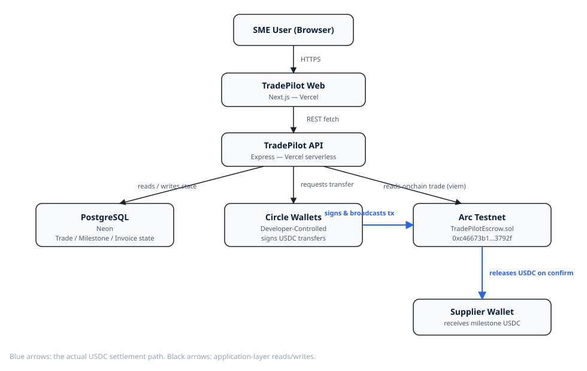

# TradePilot

**Autonomous trade finance & settlement for SMEs — built on Arc and USDC.**

TradePilot turns an SME invoice into a programmable, milestone-based USDC
escrow. An AI agent reads the invoice, proposes a payment workflow (order /
shipment / delivery), and — once a human approves — drives the trade through
Circle's developer-controlled wallets and a custom escrow contract on Arc.
Every completed trade contributes to a verifiable SME Credit Passport.

Built for the **Ignyte Stablecoins Commerce Stack Challenge** — Track 2: Best
SME Trade Finance & Working Capital Workflow.

**Live demo**: [web-psi-rose-15.vercel.app](https://web-psi-rose-15.vercel.app) — fully wired to a live Postgres database, Circle developer-controlled wallet, and an escrow contract deployed on Arc Testnet ([`api-sigma-hazel-15.vercel.app`](https://api-sigma-hazel-15.vercel.app) for the API).

## Why this exists

International SME trade still runs on trust-first, paperwork-heavy rails:
banks, manual reconciliation, and payment terms nobody can verify. TradePilot
replaces "trust first, payment later" with "programmable trust, conditional
payment" — USDC only releases when a milestone condition is met, and the
resulting payment history becomes a portable credit signal for the SME.

## Monorepo layout

```text
apps/
  web/        Next.js dashboard (Trades, Treasury, Credit Passport, AI Agent)
  api/        Express + Prisma backend, Circle + Arc + AI integrations
packages/
  contracts/  TradePilotEscrow.sol (Foundry)
  types/      Shared TypeScript types
  config/     Shared chain/contract config
docs/         Architecture, smart contract, Circle integration, agent, demo
```

## Architecture



See [docs/architecture.md](docs/architecture.md) for the full data flow and the AI agent's trust boundary.

## Stack

- **Frontend**: Next.js, TypeScript, Tailwind
- **Backend**: Node.js, Express, Prisma, PostgreSQL
- **AI**: OpenAI (invoice extraction + milestone recommendation)
- **Blockchain**: Solidity, Foundry, Arc Testnet
- **Circle**: Developer-Controlled Wallets, USDC, (Gateway / CCTP as stretch)

## Getting started

**Want to just try it?** Open the live demo — no setup required:
[web-psi-rose-15.vercel.app](https://web-psi-rose-15.vercel.app)

The steps below are only for running TradePilot locally (e.g. to modify the
code or point it at your own Circle/Arc/database credentials).

### 1. Install dependencies

```bash
corepack enable
pnpm install
```

### 2. Configure environment

```bash
cp .env.example .env
cp .env.example apps/api/.env
```

Fill in:

| Variable | Where to get it |
| --- | --- |
| `CIRCLE_API_KEY` / `CIRCLE_ENTITY_SECRET` / `CIRCLE_WALLET_SET_ID` | [Circle Developer Console](https://console.circle.com) — see `docs/circle-integration.md` |
| `ARC_RPC_URL` / `ARC_CHAIN_ID` | Arc Testnet — [Arc docs](https://docs.arc.network) |
| `USDC_ADDRESS` / `ESCROW_ADDRESS` | Testnet USDC address + your deployed `TradePilotEscrow` |
| `DATABASE_URL` | Local or hosted PostgreSQL |
| `OPENAI_API_KEY` | OpenAI platform |

### 3. Database

```bash
cd apps/api
pnpm prisma:migrate
pnpm seed
```

### 4. Smart contract

```bash
cd packages/contracts
forge install --no-git foundry-rs/forge-std OpenZeppelin/openzeppelin-contracts
forge test
forge script script/Deploy.s.sol:Deploy --rpc-url $ARC_RPC_URL --broadcast
```

Copy the deployed address into `ESCROW_ADDRESS`.

**Already deployed on Arc Testnet**: [`0xc46673b16c94d2898c59aeaa0fd588f2af13792f`](https://testnet.arcscan.app/address/0xc46673b16c94d2898c59aeaa0fd588f2af13792f) — a full create → fund → confirm → release cycle has been run against it live (see `docs/demo.md` for transaction hashes).

### 5. Run the app locally (optional)

The steps above are only needed if you want to run TradePilot on your own
machine — for example to modify the code or point it at your own Circle/Arc
credentials. **To just try the product, skip straight to the live demo
link at the top of this README** — it already runs against a live database,
Circle wallet, and the deployed Arc contract.

```bash
pnpm dev
```

- Web: http://localhost:3000
- API: http://localhost:4000

## Demo scenario

The vertical slice we demo end-to-end:

```text
Upload invoice → AI extracts terms → AI recommends milestone escrow
  → user approves → escrow funded on Arc → shipment confirmed
  → milestone released in USDC → Credit Passport updates
```

See `docs/demo.md` for the full script.

## Circle Product Feedback

See `docs/circle-integration.md` for why we chose each Circle product, what
worked well, and what we'd improve.
